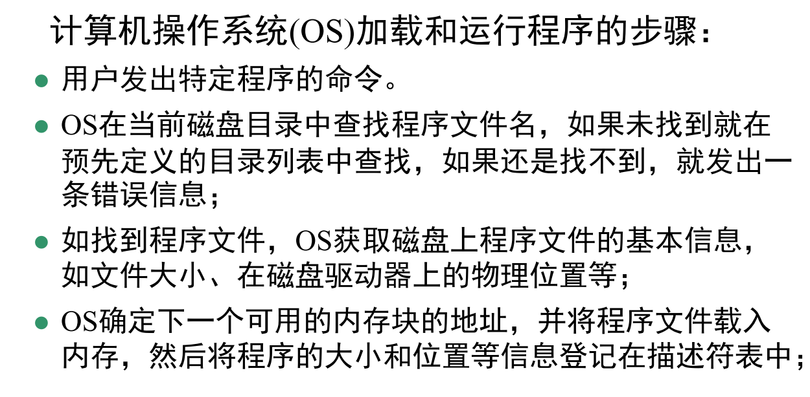
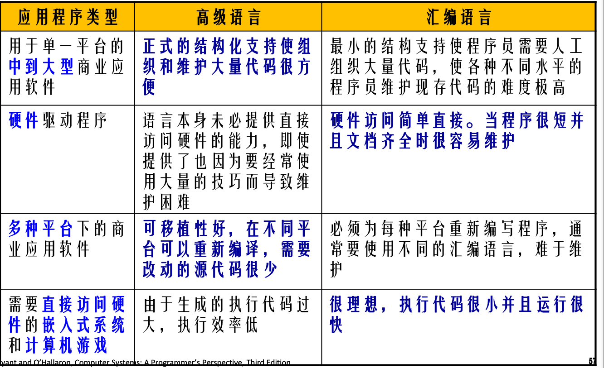

# 典型例子

[TOC]

### hello word执行过程 结合fork，shell

1. shell输入./hello
2. shell命令行解释器构造参数argv,envp
3. 调用fork创建子进程，地址空间和父进程完全相同
4. 调用execve函数，再当前新建的子进程上下文加载并运行子程序。将.text，.data,.bss等节加载到当前进程的虚拟地址空间
5. 调用hello的main函数，再一个进程上下文运行

### 流水线工作

### 链接流程

### 虚拟地址翻译过程

1. 处理器吧虚拟地址VA发送给MMU,MMU将VA的VPN，生成页表项地址，发送给高速缓存
2. 检查页表项的有效位，若为0，触发异常缺页，执行缺页异常处理程序。缺页处理程序选择牺牲页，若牺牲页被修改则写回。
3. 再从磁盘中调出新页，更新页表项PTE
4. 重新执行导致缺页的指令

### Y86-64结构

汇编语言和高级语言比

