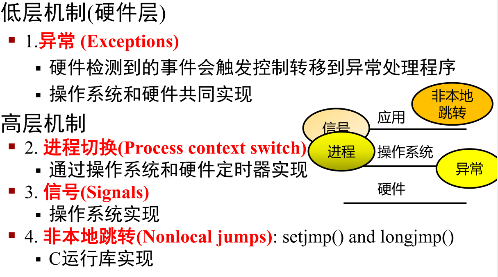
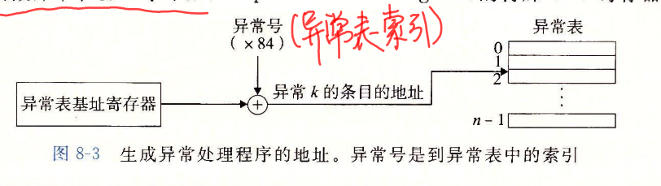
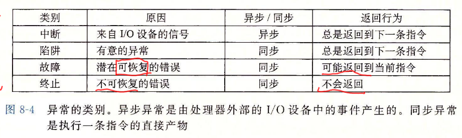
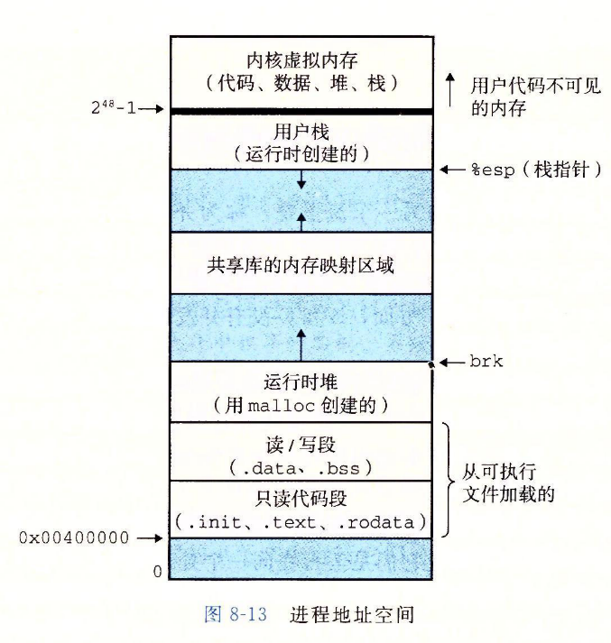
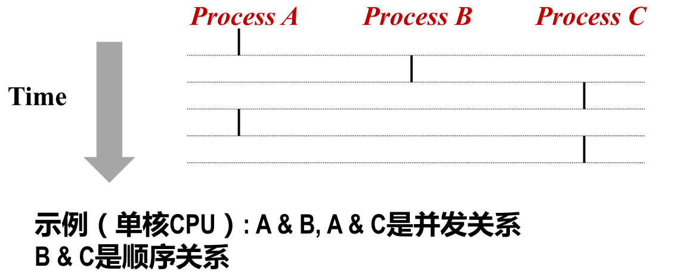
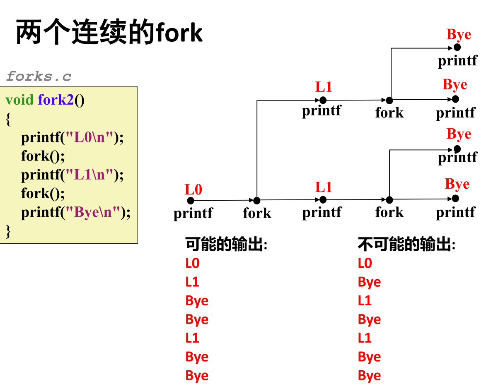
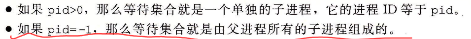
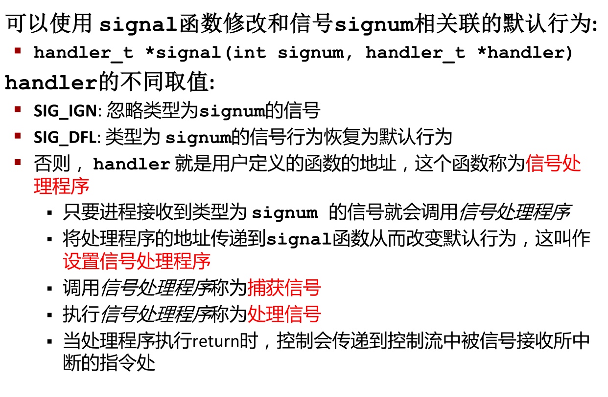
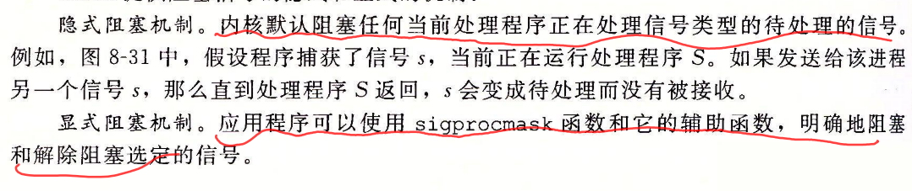
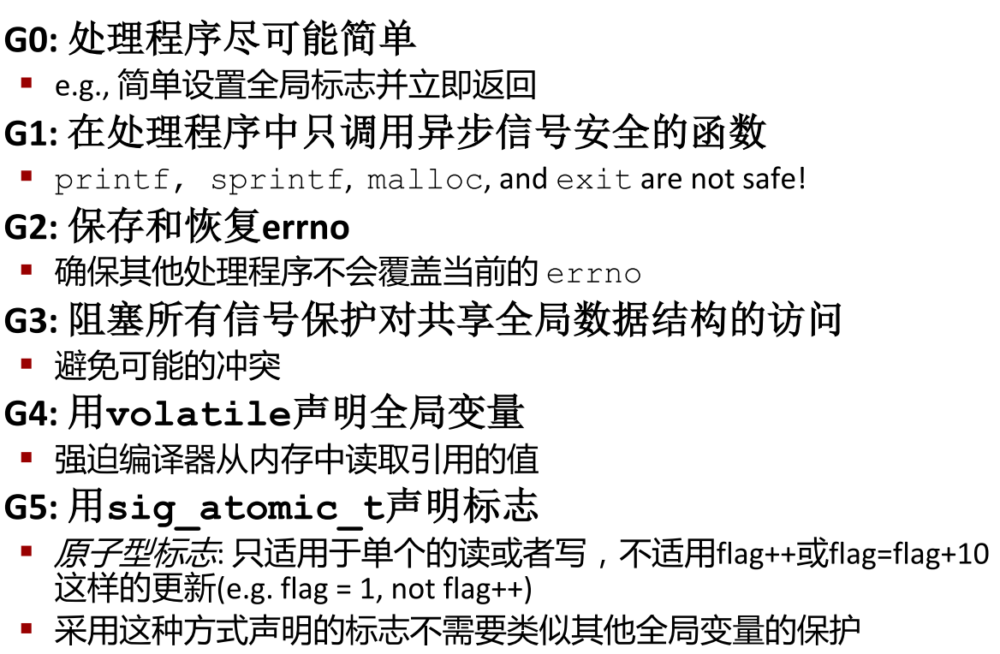

# 异常流

[TOC]

## 控制流

处理器从加电到断电，处理器只是简单读取执行一个指令序列，这个指令序列就是处理器的控制流

### 改变控制流

 跳转，分支调用，返回，可以对（由程序变量表示的）程序状态变化作出反应

但是对于系统状态变化难以反映，如除零错误。现代系统通过使控制流发生突变对这些情况做出反 应，称为“异常控制流

## 异常控制流

发生在计算机系统的各层次。

## 异常

异常是指为响应某个事件将控制权转移到操作系统内核中的情况，有异常表和异常偏移寄存器二者定位，从而执行相应的异常处理程序。最后结果 控制返回给当前指令，返还给下一条指令，终止被中断程序。异常处理程序均工作在内核模式

异常类别

### 异步异常

#### 中断

由处理器外部IO设备引起，处理器的中断引脚电位变化，中断处理程序最终返回到下一条指令处 

例子 时钟中断，Ctrl-c 网络数据包

### 同步异常

#### 陷阱

有意的，执行指令的结果，陷阱处理程序将控制返回给下一条指令。

例子：系统调用，用户程序和内核之间的接口。

#### 故障

不是有意，可能被修复，处理程序要么重新执行已修复的指令，要么终止。

例子：缺页（可恢复），一般保护故障（不可恢复，引用了一个未定义的虚存区域，一般称为段故障），浮点异常（除0），机器检查（检测到致命错误，不返回控制）

linux系统调用每个都有调用号，对应一个到内核跳转表大的偏移量，存放在通用寄存器rax，而不是栈传递。从系统调用返回时rcx和r11会被破坏

#### 终止

非故意，不可恢复致命错误造成，最后终止当前程序

如：非法指令（SIGSEGV），奇偶校验错误，机器检查

## 进程

两个关键抽象：

- 逻辑控制流 每个程序似乎独立占用CPU,通过OS内核上下文切换机制

- 私有地址空间：每个程序似乎独占使用内存，OS虚拟内存机制

进程地址空间

### 并发

每个程序是个逻辑控制流，如果两个逻辑时间有重叠，则称为并发，否则顺序。

## 进程控制

#### 系统调用错误处理

当Linux系统级函数遇到错误时，通常返回-1并设置 全局整数变量errno

规定：必须检查每个系统级函数返回状态。只有少数返回为空的函数

#### 进程终止

进程会因为三种原因终止: 

1. 收到一个信号，该信号的默认行为是终止进程 
2. 从主程序返回 
3. 调用exit函数，正常返回状态0，以status参数退出状态终止进程

#### 进程图刻画fork

是图的拓扑排序

### 僵死进程

waitpid函数 

等待集合成员根据pid确定，option可以修改默认行为。默认是挂起调用进程，调用进程没有子进程，返回-1errono为ECHILD，若中断返回，返回-1，errno设置为EINTR

wait（int *child_status）均可让父进程回收子进程,根据参数状态决定检查方式

## 信号

发送信号：内核通过更新目的进程上下文中的某个状态，发送 （递送）一个信号给目的进程

- 发送信号
  - 进程组
  - 通过/bin/kill程序发送 /bin/kill 9（信号名） pid（pid为-，发送整个组）
  - 通过键盘,如ctrl-c（z 挂起）发送SIGINT（SIGSTP）信号给前台进程组每个信号
  - kill函数
  - alarm

可能原因：内核检测到一个系统事件如除零错误(SIGFPE)或者子进程 终止(SIGCHLD)，一个进程调用了kill系统调用，显式地请求内核发送一 个信号到目的进程

接受信号：当目的进程被内核强迫以某种方式对信号的发送做出反应 时，它就接收了信号

反应的方式：忽略，终止，捕获

- 待处理信号：一个发出而没有被接收的信号叫做待处理信号
  - 任何时刻，一种类型至多只有一个待处理信号
  - 信号不会排队等待，如果进程已有类型为k的待处理信号，则接下来k被抛弃

- 阻塞信号：阻塞的信号仍可以被发送，但不会被接收，直到进程取消 对该信号的阻塞
- 一个待处理信号最多只能被接收一次

- 待处理位/阻塞位，有待处理位向量和阻塞位向量，可通过sigpromask设置

  

#### 信号默认行为

通过signal设置处理函数

#### 阻塞和解除阻塞信号

内核默认阻塞与当前正在处理信号类型相同的待处理信号.如，一个SIGINT 信号处理程序不能被另一个SIGINT信号中断 （此时另一个SIGINT信号被阻塞）

### 编写处理程序原则

函数是异步信号安全的指函数要么是可重入的，要么不能被信号处理 程序中断