# 虚拟内存

[TOC]

虚拟内存提供了三个重要功能

- 在主存自动缓存最近使用的存放磁盘地址空间的内容 --有效使用主存
- 简化内存管理，进而简化了链接，共享数据，内存分配和程序加载 --进程使用统一线性地址空间，独立地址空间
- 虚拟内存通过在页表目郑家保护位，实现内存保护。

虚拟内存被组织为一个存放在磁盘的N个连续字节大小单元。VM系统通过将虚拟页分割称为虚拟页VP,物理内存则为PP,二者大小相同

虚拟页面集合分为三个不相交的子集

- 未分配，VM系统还未分配未创建，不占磁盘空间
- 缓存 当前缓存在内存中的已分配页
- 未缓存，已分配但是为缓存在物理页

主存采用DRAM,其不命中惩罚很大，尤其是访问第一个字节。DRAM总是使用写回而不是只写，且采用全相联。

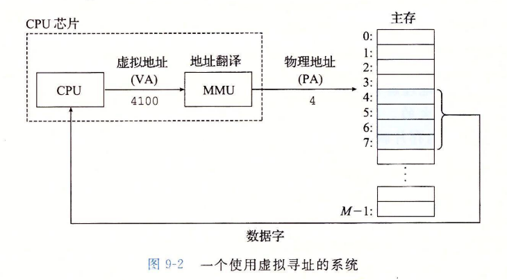

#### 再看链接加载

独立地址空间允许每个程序使用相似地址空间，代码，数据，堆使用相同的其实地址

Loading 加载 

- execve 为代码段和数据段分配虚拟页，并标记为无效（即未被缓存）

- 每个页面被初次引用时，虚拟 内存系统会按照需要自动地调 入数据页。

- 加载时信息不会从磁盘调入，而是是进行了映射

  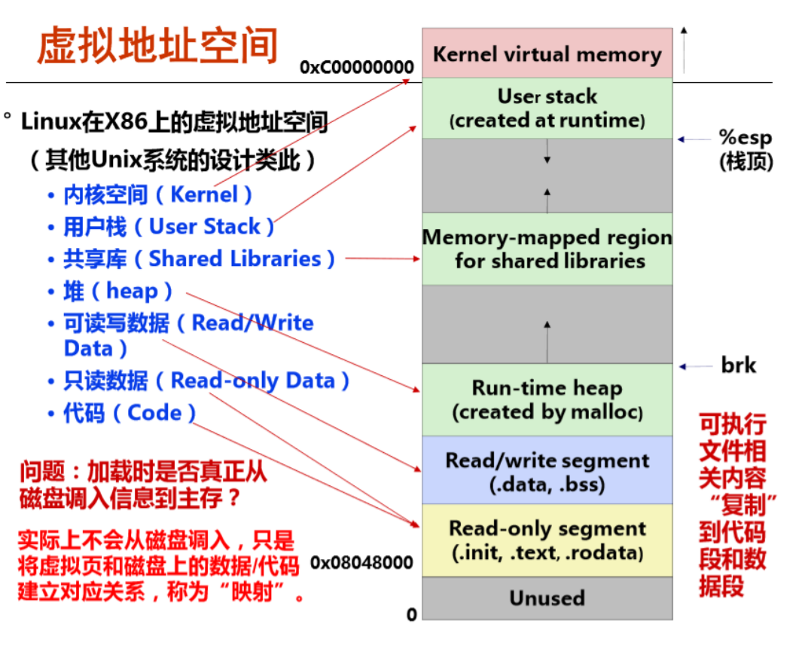

## 页表

每个进程都有自己的页表，将虚拟页转到物理页。缺页不命中时会选择牺牲页，若牺牲页被修改则协会到磁盘。然后修改表目，从磁盘复制对应页，更新页表。

计算机使用的是按需页面调度

分配页面则是磁盘创建空间，并更新PTE,指向新页面

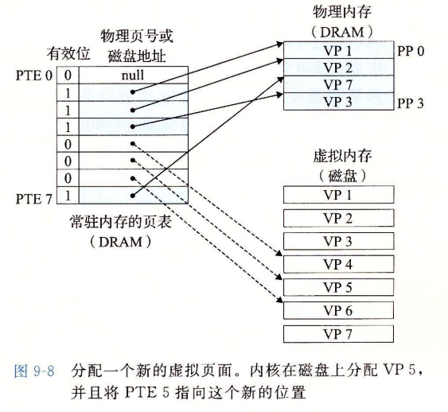

## 虚拟内存作为内存管理工具

按序页面调度和独立虚拟地址空间。

VM简化了链接，加指、代码和数据共享以及应用程序内存分配

- 简化链接，独立地址空间允许进程内存映像使用相同基本格式，无需在意代码和数据物理内存实际位置
- 简化加载 。容易向内存加载可执行文件和共享对象文件  
- 简化共享
- 简化内存分配，虚拟内存向用户进程提供了一个简单分配各位内存机制。可以将连续的虚存页映射到不连续的物理页

## 虚拟内存地址翻译

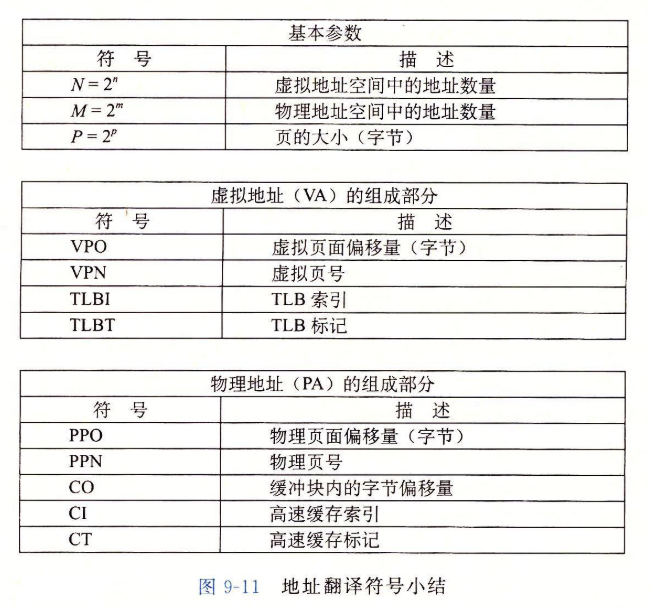

MMU通过VPN选择PTE，将物理页和虚拟地址VPO链接得到地址。

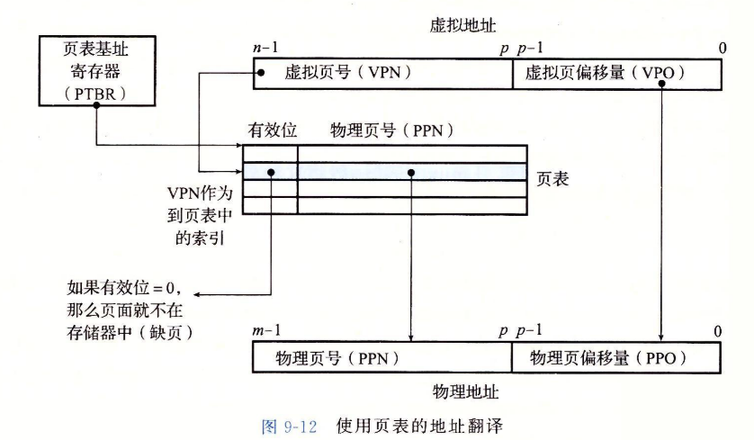

命中

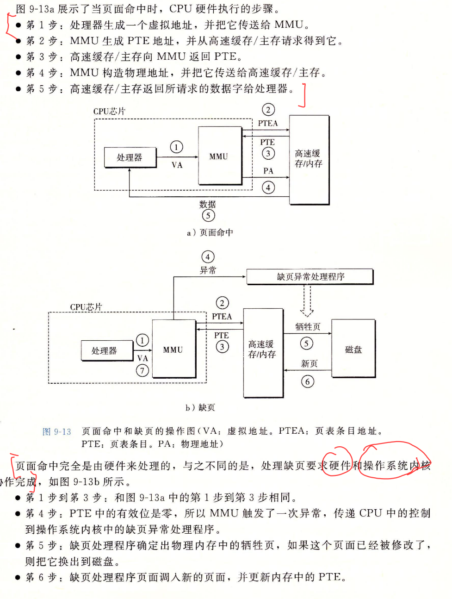

地址翻译发生在高速缓存之前。

#### TLB加速地址翻译

TLB是页表缓存，高相联度

有较高相联度，在MMU

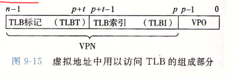

TLB命中和不命中

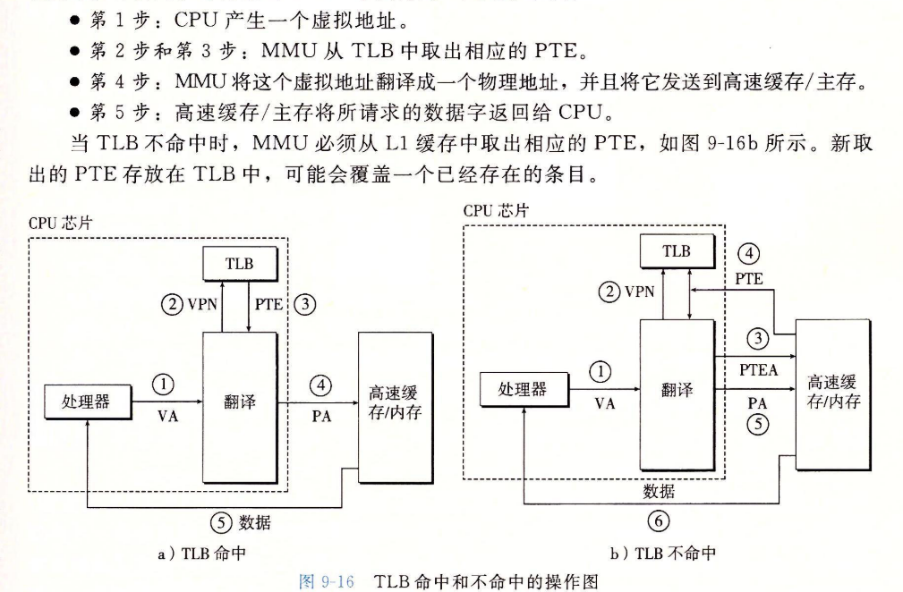

物理地址

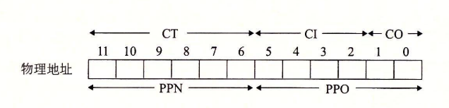

#### Linux进程的虚拟地址空间

linux将内存组织为一些区域集合，pgd指向第一级页表，vm_prot描述这个区域所有页的读写许可权限，vm_flags描述此页面是其他共享还是私有

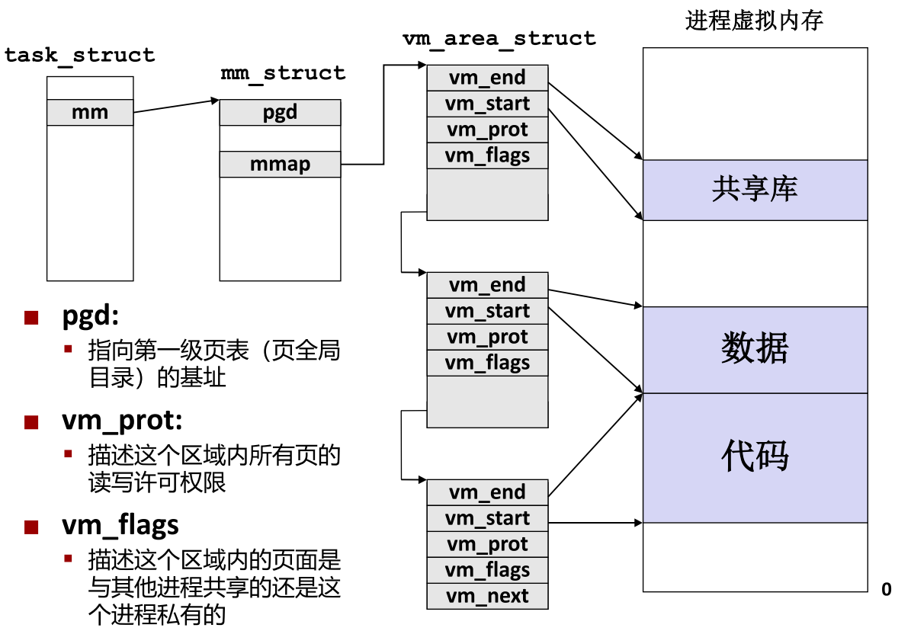

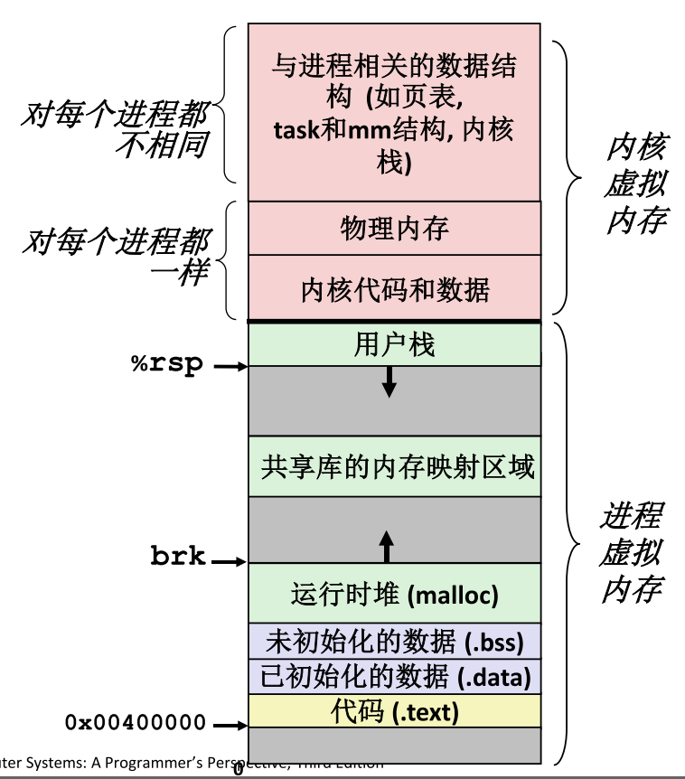

### 内存映射

Linux通过将虚拟内存区域与磁盘上的对象关联起来以初始 化这个虚拟内存区域的内容

根据初始值分为

- 普通文件 （eg可执行目标文件）文件区被分成页大小的片，对虚拟页面初始化（执行按需页面调 度

- 匿名文件 CPU第一次引用该区域内的虚拟页面时会分配一个全是零的物理 页 (demand-zero page请求二进制零的页),修改后和其他页面相同

  

初始化后的页面在内存和交换文件（swap file）之间换来换去

对象映射到虚拟内存的区域，要么作为共享，要么私有。作为共享 物理内存中只有一个 该共享对象的副本。对共享对象写操作可见

私有的写时复制 

- 两个进程都映射 了私有的写时复 制对象

- 读 区域结构被标记 为私有的写时复 制

- 私有区域的页表条目都被标记为 只读

- 写私有页会触发保护故障，故障处理程序创建修改页的副本，故障处理返回指向执行写。尽可能延迟拷贝

- fork就是写实复制机制

  - 为新进程创建虚拟内存 
    - 创建当前进程的的mm_struct, vm_area_struct和页表的原样副 本.
    - 两个进程中的每个页面都标记为只读 
    - 两个进程中的每个区域结构（vm_area_struct）都标记为私有的 写时复制（COW
    - 在新进程中返回时，新进程拥有与调用fork进程相同的虚拟 内存
    - 写时复制

  execve

  - 删除已存在的用户区域
  - 创建新的区域结构
    - 代码和初始化数据映射到.text和.data区（目标 文件提供,在磁盘）
    -  .bss和栈映射到匿名文件
  - 设置pc，指向代码区域入口点
    - Linux根据需要换入代码和数据页面

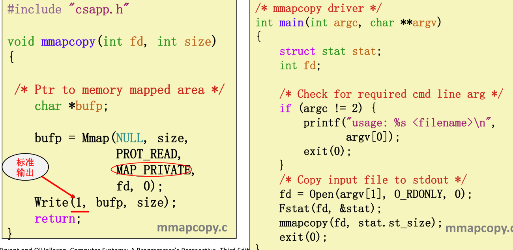

### 动态内存分配

分配器将堆视为一组不同大小的块(blocks)的集合来维 护，每个块要么是已分配的，要么是空闲的

分配器的性能目标

- 吞吐量 每个单位时间内完成的请求数
- 最大化内存利用率 请求Rk 完成后, 聚集有效载荷Pk 为当前已分配的块的有 效载荷之和

知道释放量

- 头部信息

记录，跟踪空闲块

- 隐式空闲链表通过头部中的大小字段隐含地连接空闲块
- 显式空闲链表在空闲块中使用指针连接空闲块
- 分离的空闲链表 
  - 每个大小类的空闲链表包含大小相等的块
- 按照大小排序的块，如平衡二叉树

#### 显式内存分配

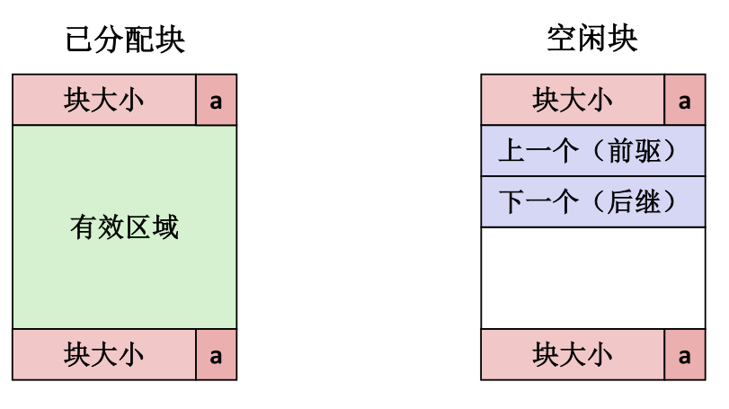

保留空闲块链表, 而不是所有块，

- 下一块可能任何地方，需要保存前驱后继
- 还需要合并边界标记，合并空闲块
- 我们只跟踪空闲块，所以我们可以使用有效区域

插入

- LIFO 后进先出
  - 将新释放的块放置在链表的开始处
  - Pro好处: 简单，常数时间 
  - Con不足: 研究表明碎片比地址排序更糟糕
- 地址顺序 
  - 按照地址维护addr(祖先) < addr(当前回收块) < addr(后继)
  - 需要搜索
  - 但是碎片少于LIFO

相比隐式链表

- 分配时间从块总数的线性时间减少到空闲块数量的线性时间
- 因为需要在列表中拼接块，释放和分配稍显复杂一些
- 每个块需要两个额外的字

最常用的链表连接是将分离的空闲链表结合在一起，维护多个不同大小类

#### 隐式内存分配

隐式链表法 

- first fit,next fit,best fit
- 分配空闲块：分割，是否空闲有标志位，为与前面一块合并，需要设置边界标记，且只有空闲才需要

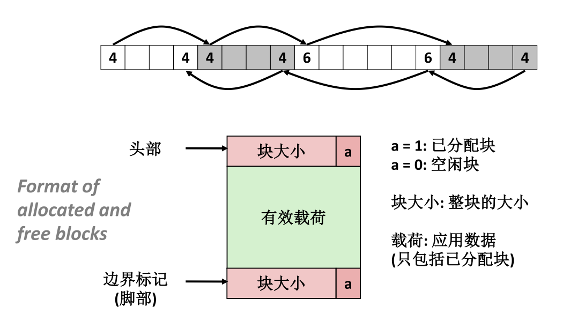

### 分离的空闲链表

每个大小类的块构成一个空闲链表。

分配器维护空闲链表数组，每个大小类一个空闲链表

如果空闲链表中没有合适的块: 

-  向操作系统请求额外的堆内存 (使用sbrk()) 
-  从这个新的堆内存中分配出n字节 
-  将剩余部分放置在适当的大小类中

### 垃圾收集

垃圾收集器视作内存为一张有向可达图，图节点分为一组根节点和一组堆节点。堆节点对应一个已分配块。有向边这表示P中某个位置指向另一个块。根节点对应不在堆的位置（可以说寄存器，堆栈变量或者虚拟内存读写区域的全局变量）。包含指向堆的指针。

垃圾收集维护可达图某种表示，通过释放不可达点返回空闲链表，实现定期回收

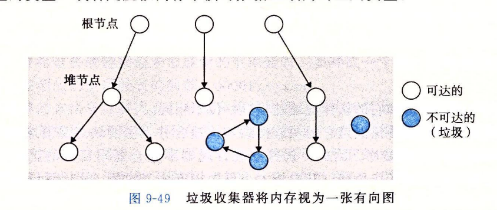

保守的垃圾收集

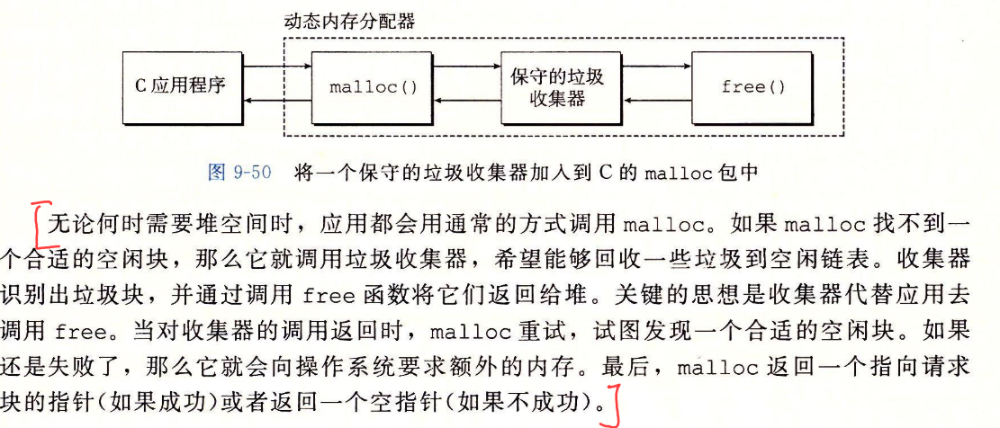

#### Mark&sweep

此收集器由标记和清除两阶段组成，标记出根节点所有可达和已分配后继

而清除释放了每个未标记的已分配块。

C语言使用保守的marksweep，因为**C语言不用任何类型信息标记内存位置**，故isPtr无法判断事发后指针，而且就算是指针，也无法明显判断p是否指向已分配快的有效内存位置（c通过平衡二叉树实现，左子树低地址）

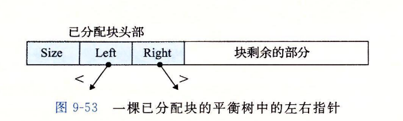

### c内存有关错误

- 间接使用坏指针 ，进程的虚拟地址空间有较大的洞，没有映射到任何有意义的数据。如果尝试引用这类指向空洞指针，操作系统就会异常终止。而且虚拟内存有些区域只是可读，试图写此区域也会异常终止 如scanf("%d",val)尝试写地址
- 读未初始化内存。malloc分配内存并未初始化。堆内存需要显示初始化，用calloc
- 允许栈缓冲区溢出。若程序不检查栈大小直接写入栈，可能溢出。
- 假设指针和指向对象大小相同
- 造成错位错误，可能覆盖，也就是越界
- 引用指针，而不是对象 $*size--与 *(size)--$
- 引用不存在变量
- 误解指针运算
- 引用空闲堆块数据
- 内存泄漏