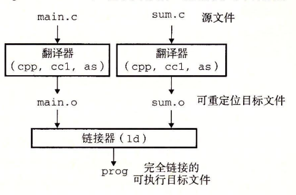
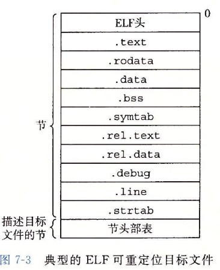

# 链接

[TOC]

## 编译器驱动程序

静态链接过程

gcc -0g -o prog main.c sum.c

main.c通过CPP（c语言预处理器）变为main.i，在通过c编译器ccl翻译为main.s的Ascii汇编文件再通过as汇编器形成main.o可重定位目标文件。同样生成sum.o最后运行ld连接器程序，将文件组合，创建可执行目标文件

linux的shell调用操作系统加载器函数，将可执行文件的prog代码和数据复制到内存，然后控制转移到此程序开头。

## 静态链接

为构造可执行目标文件，链接器必须完成两个任务

### 符号解析

目标文件定义和引用符号，每个符号对应一个函数，一个全局变量或者一个静态变量。符号解析将符号引用和符号定义关联

### 重定位

编译器和汇编器生成从0地址开始的代码和数据节。链接器通过把每个符号定义和内存位置关联而重定位，然后修改引用，指向内存。链接器使用汇编器产生的重定位条件，不加判别的执行重定位

## 目标文件

## 可重定位目标文件

ELF （可执行可连接格式）典型可重定位目标文件格式

- .text存放代码

- .rodata 只读数据，如printf格式串和开关语句跳转表
- .data  **已初始化的全局变量和静态C变量**，局部C变量保存至栈,不在.data,也不再.bss
- .bss **未初始化的全局和静态c变量，以及所有被初始化为0的全局或者静态变量**，在目标文件不占实际空间，只是一个占位符。运行时内存分配。
- symtab 符号表，用于存放程序定义和引用的函数和全局变量信息。不包含局部变量条目
- .rel.text  通常省略，用于重定位
- .rel.data 被模块引用或者定义的所有全局变量的重定位信息
- .debug存放的是局部变量定义和类型定义。

## 符号和符号表

## 符号解析

